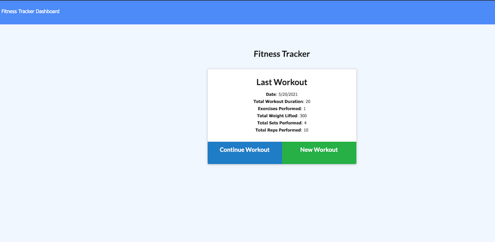

# Mongo-Excercise-Tracker

## Table of contents
- [Description](#Description)
- [Installation](#Installation)
- [Usage](#Usage)
- [License](#License)
- [Technologies Used](#Technologies)
- [Contributors](#Contributors)
- [Tests](#Tests)
- [Repository Link](#Repository)
- [Deployed Link](#Deployed)
- [GitHub Info](#GitHub) 

## Description 
This MongoDB Exercise Tracker application allows the user create, update, and save their workout data (exercise type, weight, duration, etc.) to track their hardwork and progress. The app also allows the user view and track all of their work from the previous 7 day period.  

## Installation
Prerequisites to run the app: Node.js, Express.js and MongoDB. Then clone the repository and run 'npm i' and 'npm start' in the command line. You can also prepopulate the database with 'npm run seed'.

## Usage
Fast and easy app to help a user create, update, and save workout data to stay fit and healthy.  

## License
ISC

## Technologies
Node.js, Express.js, Mongoose, and MongoDB

## Contributors
Stefan Podzinski 

## Tests
N/A

## Repository
- https://github.com/stefanpodz303/Mongo-Excercise-Tracker

## Deployed
- https://mongodb-exercise-tracker.herokuapp.com/?id=60a9078cc434ea0016fc1546

## GitHub
- stefanpodz303
- stefanpodz@yahoo.com
- https://stefanpodz303.github.io/Stefan-Podzinski-Portfolio/